# Super DX-Ball Remake

A faithful web-based recreation of the classic **Super DX-Ball** arcade game, built with vanilla JavaScript and HTML5 Canvas.


## 🎮 Play

**[Play Online →](https://krdav.github.io/super-dx-ball/)**

## Features

- 🧱 **5 Unique Levels** — Classic Grid, Diamond, Fortress, Checkerboard, and Arrow formations
- ⚡ **20 Power-ups** — Enlarge, shrink, fireball, 8-ball, thru-brick, mega ball, shooting paddle, and more
- 🎨 **Authentic Aesthetics** — 3D metallic pillar walls, blue metallic paddle, golden ball, and DX-Ball color palette bricks with pronounced 3D bevel
- 📊 **Arcade HUD** — Yellow bitmap-style score and golden ball-icon lives display
- 🔥 **Classic Gameplay** — Angle-based paddle reflection, brick patterns, and progressive difficulty

## Power-ups

| Icon | Name | Effect |
|:---|:---|:---|
| 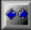 | Enlarge | Increases paddle size |
| 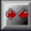 | Shrink | Decreases paddle size |
|  | Super Shrink | Drastically decreases paddle size |
|  | Extra Life | +1 life |
|  | Kill | -1 life |
| 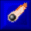 | Fireball | Bounces and destroys surrounding bricks |
| 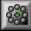 | 8-Ball | Spawns 7 extra balls |
| 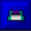 | Grab | Catch ball on paddle |
|  | Fast | Increases ball speed |
| 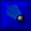 | Slow | Decreases ball speed |
|  | Shooting Paddle | Fire laser bullets |
| 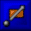 | Thru Brick | Ball passes through bricks |
| 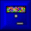 | Level Warp | Skip to next level |
| 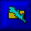 | Zap Bricks | Randomly destroy bricks |
|  | Mega Ball | Unstoppable ball |
|  | Shrink Ball | Decreases ball size |
| 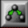 | Split Ball | Doubles all balls |
| 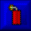 | Exploding | Explodes a brick |
| 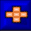 | Expand Exploding | Chain brick explosions |
| 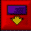 | Falling Bricks | Bricks descend toward paddle |

## Tech Stack

- **Vanilla JavaScript** (ES6+ modules)
- **HTML5 Canvas** for rendering
- **No build step** — runs directly in the browser
- **No dependencies** for the game itself

## Run Locally

```bash
# Clone the repo
git clone https://github.com/YOUR_USERNAME/super-dx-ball.git
cd super-dx-ball

# Serve with any static server
npx live-server --port=8090
```

Or simply open `index.html` with any HTTP server.

## Controls

- **Mouse** — Move paddle
- **Click / Space** — Launch ball, release grabbed ball, fire bullets
- **Arrow Keys** — Alternative paddle movement

## Project Structure

```
├── index.html          # Entry point
├── assets/
│   └── powerups/       # 20 power-up sprite images (31x31px)
└── src/
    ├── main.js          # Bootstrap
    ├── style.css        # Canvas styling
    ├── engine/
    │   ├── Game.js      # Main game loop, physics, HUD, pillar walls
    │   ├── Constants.js # Playfield boundaries and defaults
    │   ├── InputHandler.js
    │   └── LevelManager.js  # 5 level definitions
    └── entities/
        ├── Ball.js      # Golden ball with specular highlight
        ├── Paddle.js    # Blue metallic gradient paddle
        ├── Brick.js     # 3D beveled bricks
        ├── PowerUp.js   # 20 power-up types with sprite loading
        └── Bullet.js    # Shooting paddle projectiles
```

## Credits

Inspired by **Super DX-Ball** by Blitwise Productions (2004-2007).

Power-up sprites extracted from the original DX-Ball 2 sprite sheet.

## License

MIT
